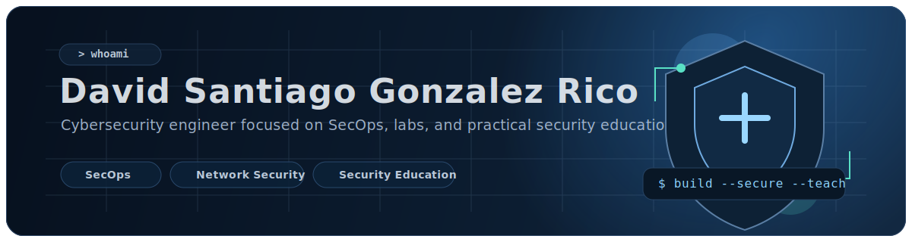

  

<h1 align="center">David Santiago Gonzalez Rico</h1>

<strong>Cybersecurity Engineer | SecOps | Linux | Security Education</strong>

  Cybersecurity engineer focused on SecOps, Linux administration, network security, and practical security education.

  I build hands-on security projects and training platforms that connect defensive operations, offensive-security practice, and clear teaching.

  Open to collaboration on phishing-awareness training, security labs, and blue-team or CTF workflow tooling.

  

  
  
  
  

## At a Glance

- Cybersecurity master's student at ESME Paris
- SecOps-informed security background
- Instructor in Computer Architecture at Pontificia Universidad Javeriana
- Builder of phishing-awareness platforms and CTF / pentest workflow tooling

## What I Build

- Practical security education experiences for students and technical teams
- Reproducible CTF, pentest, and reporting workflows
- Blue-team-minded projects around phishing analysis, Linux operations, and network security

## Currently Exploring

- AI-assisted reporting flows for cyber labs, writeups, and evidence capture
- More measurable phishing-awareness training for engineering students
- Repeatable blue-team and CTF workflows across Docker-based lab environments

## Languages and Education

### Spoken Languages

  
  
  

### Universities

  
  

## Focus Areas and Toolkit

I work where defensive operations, hands-on training, and reproducible lab workflows overlap.

  
  
  
  
  
  

Selected from the public stack visible across my current projects.

  
<strong>Expand full stack, operating systems, lab environments, and cloud platforms</strong>

   

  ### Languages I Use

  

    
    
    
    
    
    
    
    
    
  

  ### Operating Systems

  

    
    
    
    
    
    
  

  ### Lab and Virtualized Environments

  

    
    
    
    
    
    
  

  ### Cloud Environments

  

    
    
    
    
    
    
    
    
    
    
  

## Featured Work

<table>
  <tr>
    <td width="50%" valign="top">
      <h3><a href="https://github.com/Panacota96/master-Project-Phishing">EnGarde</a></h3>
      

        
        
      

      
Serverless phishing-awareness platform for engineering students with quiz flows, guided email analysis, and instructor analytics.

      
<strong>Why it matters:</strong> turns phishing defense into something hands-on, measurable, and deployable.

    </td>
    <td width="50%" valign="top">
      <h3><a href="https://github.com/Panacota96/Guild-Scroll">Guild-Scroll</a></h3>
      

        
        
      

      
Terminal flight recorder for authorized pentests and CTFs with structured JSONL capture, ATT&amp;CK mapping, exports, and a TUI or web preview.

      
<strong>Why it matters:</strong> shows practitioner-grade workflow tooling and disciplined security reporting.

    </td>
  </tr>
  <tr>
    <td width="50%" valign="top">
      <h3><a href="https://github.com/Panacota96/Helm-Path">Helm-Path</a></h3>
      

        
        
      

      
Local-first CTF flight recorder and writeup generator with Dockerized logging, hashed manifests, an append-only audit chain, and a graph UI.

      
<strong>Why it matters:</strong> proves a strong focus on reproducible evidence capture and AI-assisted reporting.

    </td>
    <td width="50%" valign="top">
      <h3><a href="https://github.com/Panacota96/ai-cyber-lab">AI Cyber Lab</a></h3>
      

        
        
      

      
Desktop-first cyber lab workspace for CTF, lab, and pentest documentation with multiple export paths, timelines, and persistent storage.

      
<strong>Why it matters:</strong> connects practical lab work with clearer reporting and research outputs.

    </td>
  </tr>
</table>

## Teaching and Community

- I teach Computer Architecture at Pontificia Universidad Javeriana.
- I care about making security concepts concrete through labs, walkthroughs, and student-friendly tooling.
- I am especially interested in projects that improve phishing defense, blue-team readiness, and practical cybersecurity learning.

## Connect

  

## Support

If my projects, labs, or writeups help you, you can support the work here.

  

